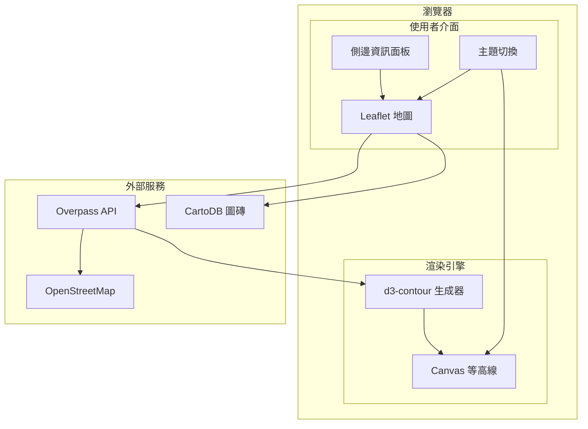

# The Topography of Care 關懷地景

[](https://www.gnu.org/licenses/agpl-3.0)
[](https://developer.mozilla.org/en-US/docs/Web/JavaScript)
[](https://leafletjs.com/)

[← 回到 Muripo HQ](https://tznthou.github.io/muripo-hq/) | [English](README_EN.md)

將台灣在地的社福資源轉化為地圖上的「溫暖地形」。透過等高線的起伏，看見關懷資源的覆蓋深度，並識別出那些仍需守望的「寂靜深谷」。


> **「山峰是守護，深谷是呼喚。每一條等高線，都是關懷的輻射。」**

---

## 功能特色

- **等高線視覺化**：將資源點轉化為能量場，生成有機的地形等高線
- **即時 OSM 資料**：透過 Overpass API 即時抓取 OpenStreetMap 台灣資料
- **四種資源類型**：醫院、診所、圖書館、社福機構
- **資源篩選**：可自由開關各類型資源的顯示
- **主題切換**：支援 Positron（淺色）與 Dark Matter（深色）圖磚
- **點擊互動**：點擊地圖查看最近的設施資訊
- **響應式設計**：適應各種螢幕尺寸

---

## 人文美學映射

| 視覺元素 | 數據來源 | 映射邏輯 |
|---------|---------|---------|
| **山峰** | 資源點位置 | 每個資源點是一個能量源，形成「守護山脈」 |
| **等高線顏色** | 能量密度 | 綠 → 金 → 橘 → 紅（低 → 高） |
| **等高線密度** | 資源聚集度 | 線條越密集，資源越集中 |
| **深谷（空白）** | 資源稀缺區 | 缺乏等高線的區域，是關懷最應觸及的地方 |

---

## 資源類型與權重

| 類型 | OSM 標籤 | 擴散半徑 | 能量振幅 |
|------|----------|----------|----------|
| 🏥 醫院 | `amenity=hospital` | ~600m | 1.0 |
| 🏨 診所 | `amenity=clinic` | ~300m | 0.5 |
| 📚 圖書館 | `amenity=library` | ~500m | 0.7 |
| 🏠 社福機構 | `social_facility=*` | ~400m | 0.8 |

---

## 系統架構



---

## 技術棧

| 技術 | 用途 | 備註 |
|------|------|------|
| Leaflet 1.9.4 | 地圖引擎 | 載入圖磚、座標轉換 |
| d3-contour | 等高線生成 | Marching Squares 演算法 |
| Overpass API | OSM 資料抓取 | 即時查詢台灣資源點 |
| Canvas API | 等高線渲染 | 原生 JavaScript |
| Tailwind CSS | UI 樣式 | CDN 載入 |

---

## 快速開始

### 環境需求

- 現代瀏覽器（Chrome、Firefox、Safari、Edge）
- 本地 HTTP 伺服器（用於開發）

### 使用方式

```bash
# 進入專案目錄
cd day-24-topography-of-care

# 方法 1：使用 Python 內建伺服器
python3 -m http.server 8080

# 方法 2：使用 VSCode Live Server
# 右鍵 index.html → Open with Live Server

# 方法 3：直接開啟（部分功能可能受限）
open index.html
```

開啟瀏覽器訪問 `http://localhost:8080`

---

## 專案結構

```
day-24-topography-of-care/
├── index.html              # 主頁面
├── static/
│   ├── css/
│   │   └── main.css        # 主樣式
│   └── js/
│       ├── map.js          # Leaflet 地圖模組
│       ├── overpass.js     # Overpass API 客戶端
│       ├── contour.js      # 等高線生成（d3-contour）
│       ├── renderer.js     # Canvas 渲染引擎
│       └── app.js          # 主程式
├── assets/                  # Demo 圖片
├── README.md
├── README_EN.md
└── LICENSE
```

---

## 演算法說明

### 能量場疊加（Scalar Field）

每個資源點產生一個高斯分布的能量場：

```
energy(x, y) = A × exp(-d² / 2σ²)
```

- `A`：振幅（資源類型權重）
- `σ`：擴散半徑
- `d`：點到資源的距離

所有資源點的能量疊加形成最終的純量場。

### 等高線生成（Marching Squares）

使用 d3-contour 的 Marching Squares 演算法，將純量場轉換為多層等高線：

1. 建立 150×150 的網格
2. 計算每個網格點的能量值
3. 生成 12 層等高線閾值
4. 輸出 GeoJSON 多邊形路徑

---

## 效能考量

| 措施 | 說明 |
|------|------|
| **請求 Debounce** | 地圖移動結束 500ms 後才發送 API 請求 |
| **記憶體快取** | 5 分鐘 TTL，避免重複請求相同區域 |
| **Kumi Mirror** | 使用較快的 Overpass API 鏡像伺服器 |
| **Grid 解析度** | 150×150 網格，平衡品質與效能 |
| **條件渲染** | Zoom < 11 時不載入資料 |
| **智慧 bbox 比較** | 僅在視窗移動 >500m 或縮放 >15% 時才重新請求 |
| **距離截斷優化** | 資源能量場僅更新 3σ 範圍內的網格 |

---

## 安全性與程式碼品質

本專案經過完整的程式碼審查，針對安全性、效能與可維護性進行了多項改進：

### 安全性修復

| 項目 | 問題 | 解決方案 |
|------|------|----------|
| **XSS 防護** | 動態 HTML 未跳脫 | 使用 `escapeHtml()` 處理所有使用者可控資料 |
| **CSP 政策** | 缺少內容安全政策 | 添加完整 CSP header，限制腳本/樣式/連線來源 |
| **HTTPS 升級** | 混合內容風險 | 添加 `upgrade-insecure-requests` 指令 |
| **座標驗證** | 惡意資料注入 | 檢查座標是否在台灣邊界內 (H05) |
| **ID 驗證** | 非法 OSM ID | 確保 ID 為正整數 |

### API 穩健性

| 項目 | 問題 | 解決方案 |
|------|------|----------|
| **Rate Limiting** | 過度請求被封鎖 | 強制最小請求間隔 1 秒 (H04) |
| **429 處理** | 被限流後無回應 | 讀取 Retry-After header，自動等待 |
| **重複請求** | 並發請求浪費資源 | `isLoading` 狀態鎖 + 智慧 bbox 比較 (H02) |
| **錯誤訊息** | 技術性錯誤暴露給用戶 | 友善的中文 Toast 通知 (H01) |

### UX 與無障礙

| 項目 | 改進 |
|------|------|
| **Toast 通知** | 取代 console.log，提供視覺化錯誤/狀態回饋 |
| **SafeStorage** | localStorage 包裝，處理私密模式/配額超限 (M02) |
| **CSS 變數** | 主題切換改用 CSS custom properties (M09) |
| **ARIA 屬性** | 添加 role、aria-label、aria-live 支援螢幕閱讀器 (M04) |

### 效能優化

| 項目 | 改進 |
|------|------|
| **Reverse Update** | 等高線計算從 O(n×m) 降至 O(n×k)，k 為影響範圍 |
| **智慧更新** | bbox 變化小於閾值時跳過 API 請求 |
| **名稱截斷** | 限制長名稱 200 字元，避免記憶體膨脹 |

---

## 圖磚選項

| 圖磚 | 風格 | 適用場景 |
|------|------|----------|
| **Positron** | 淺色極簡 | 日間瀏覽、列印 |
| **Dark Matter** | 深色科技 | 夜間瀏覽、展示 |

點擊右下角 🌙/☀️ 按鈕切換主題。

---

## 隨想

### 有座標的靈魂

這不只是一個數據視覺化工具。

每一個點，都是某個人曾經標註在 OpenStreetMap 上的關懷。可能是一位志工在社區踏查後，回家打開電腦，仔細地把那間小診所的位置標上去。可能是一位圖書館員，想讓更多人知道這裡有一個溫暖的閱讀角落。

這些點，不是冰冷的座標。它們是「有座標的靈魂」。

### 山峰與深谷

當你看到等高線形成的山峰，那代表著這個區域有著密集的關懷資源。也許是醫院林立的都會區，也許是社區發展協會活躍的老社區。

但更重要的是深谷——那些沒有等高線的平原。

它們不是空白，而是呼喚。呼喚著更多的關懷、更多的資源、更多願意標註的手。

### 自己的地圖自己畫

這個專案響應 [OSM 台灣](https://osm.tw/)「自己的地圖自己畫」的精神。

如果你發現你家附近的診所沒有被標註，歡迎到 OpenStreetMap 上加上它。下次有人打開這個地圖，就會看到你種下的那座小山丘。

關懷，是可以被畫出來的。

**Explore it. Map it. Care for it.**

---

## 資料來源與授權

### 資料來源

本專案使用 [OpenStreetMap](https://www.openstreetmap.org/) 的開放地理資料，透過 [Overpass API](https://overpass-api.de/) 即時查詢。

- 地圖圖磚：[CartoDB](https://carto.com/) Positron / Dark Matter
- 資料授權：**ODbL**（Open Database License）

使用本專案時，請標註資料來源：「© OpenStreetMap contributors」

### 程式碼授權

本專案程式碼採用 [AGPL-3.0 License](LICENSE) 授權。

這意味著：
- ✅ 可自由使用、修改、散佈
- ✅ 可用於商業用途
- ⚠️ 修改後的程式碼必須以相同授權釋出
- ⚠️ 網路服務也需公開原始碼
