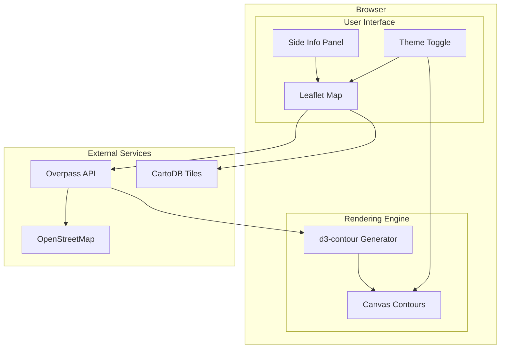

# The Topography of Care

[](https://www.gnu.org/licenses/agpl-3.0)
[](https://developer.mozilla.org/en-US/docs/Web/JavaScript)
[](https://leafletjs.com/)

[← Back to Muripo HQ](https://tznthou.github.io/muripo-hq/) | [中文](README.md)

Transforming Taiwan's local social welfare resources into a "warm topography" on the map. Through the undulation of contour lines, visualize the coverage depth of care resources and identify those "silent valleys" that still need watching over.


> **"Peaks are guardians, valleys are callings. Every contour line is the radiation of care."**

---

## Features

- **Contour Visualization**: Transform resource points into energy fields, generating organic topographic contours
- **Real-time OSM Data**: Fetch Taiwan data instantly via Overpass API from OpenStreetMap
- **Four Resource Types**: Hospitals, clinics, libraries, social welfare institutions
- **Resource Filtering**: Toggle display of each resource type freely
- **Theme Switching**: Support Positron (light) and Dark Matter (dark) tile layers
- **Click Interaction**: Click on map to view nearest facility information
- **Responsive Design**: Adapts to various screen sizes

---

## Humanistic-Aesthetic Mapping

| Visual Element | Data Source | Mapping Logic |
|----------------|-------------|---------------|
| **Peaks** | Resource locations | Each resource is an energy source, forming "guardian mountains" |
| **Contour Colors** | Energy density | Green → Gold → Orange → Red (low → high) |
| **Contour Density** | Resource clustering | Denser lines = more concentrated resources |
| **Valleys (blank)** | Resource-scarce areas | Regions without contours are where care needs to reach most |

---

## Resource Types & Weights

| Type | OSM Tag | Diffusion Radius | Energy Amplitude |
|------|---------|------------------|------------------|
| 🏥 Hospital | `amenity=hospital` | ~600m | 1.0 |
| 🏨 Clinic | `amenity=clinic` | ~300m | 0.5 |
| 📚 Library | `amenity=library` | ~500m | 0.7 |
| 🏠 Social Facility | `social_facility=*` | ~400m | 0.8 |

---

## System Architecture



---

## Tech Stack

| Technology | Purpose | Notes |
|------------|---------|-------|
| Leaflet 1.9.4 | Map engine | Tile loading, coordinate conversion |
| d3-contour | Contour generation | Marching Squares algorithm |
| Overpass API | OSM data fetching | Real-time Taiwan resource queries |
| Canvas API | Contour rendering | Native JavaScript |
| Tailwind CSS | UI styling | CDN loaded |

---

## Quick Start

### Requirements

- Modern browser (Chrome, Firefox, Safari, Edge)
- Local HTTP server (for development)

### Usage

```bash
# Enter project directory
cd day-24-topography-of-care

# Method 1: Python built-in server
python3 -m http.server 8080

# Method 2: VSCode Live Server
# Right-click index.html → Open with Live Server

# Method 3: Direct open (some features may be limited)
open index.html
```

Open browser and visit `http://localhost:8080`

---

## Project Structure

```
day-24-topography-of-care/
├── index.html              # Main page
├── static/
│   ├── css/
│   │   └── main.css        # Main styles
│   └── js/
│       ├── map.js          # Leaflet map module
│       ├── overpass.js     # Overpass API client
│       ├── contour.js      # Contour generation (d3-contour)
│       ├── renderer.js     # Canvas rendering engine
│       └── app.js          # Main application
├── assets/                 # Demo images
├── README.md
├── README_EN.md
└── LICENSE
```

---

## Algorithm Explanation

### Energy Field Superposition (Scalar Field)

Each resource point produces a Gaussian-distributed energy field:

```
energy(x, y) = A × exp(-d² / 2σ²)
```

- `A`: Amplitude (resource type weight)
- `σ`: Diffusion radius
- `d`: Distance from point to resource

All resource energies are superimposed to form the final scalar field.

### Contour Generation (Marching Squares)

Using d3-contour's Marching Squares algorithm to convert scalar field into multi-layer contours:

1. Create 150×150 grid
2. Calculate energy value at each grid point
3. Generate 12 contour threshold levels
4. Output GeoJSON polygon paths

---

## Performance Considerations

| Measure | Description |
|---------|-------------|
| **Request Debounce** | API requests sent 500ms after map movement ends |
| **Memory Cache** | 5-minute TTL, avoids repeated requests for same area |
| **Kumi Mirror** | Uses faster Overpass API mirror server |
| **Grid Resolution** | 150×150 grid, balances quality and performance |
| **Conditional Rendering** | No data loaded when zoom < 11 |
| **Smart bbox Comparison** | Only re-fetch when viewport moves >500m or zoom changes >15% |
| **Distance Truncation** | Resource energy fields only update grid cells within 3σ radius |

---

## Security & Code Quality

This project has undergone comprehensive code review with improvements for security, performance, and maintainability:

### Security Fixes

| Issue | Problem | Solution |
|-------|---------|----------|
| **XSS Protection** | Unescaped dynamic HTML | Use `escapeHtml()` for all user-controllable data |
| **CSP Policy** | Missing Content Security Policy | Added complete CSP header restricting script/style/connect sources |
| **HTTPS Upgrade** | Mixed content risk | Added `upgrade-insecure-requests` directive |
| **Coordinate Validation** | Malicious data injection | Validate coordinates are within Taiwan bounds (H05) |
| **ID Validation** | Invalid OSM IDs | Ensure ID is a positive integer |

### API Robustness

| Issue | Problem | Solution |
|-------|---------|----------|
| **Rate Limiting** | Excessive requests get blocked | Enforce minimum 1-second request interval (H04) |
| **429 Handling** | No response after rate limiting | Read Retry-After header, auto-wait |
| **Duplicate Requests** | Concurrent requests waste resources | `isLoading` state lock + smart bbox comparison (H02) |
| **Error Messages** | Technical errors exposed to users | User-friendly Chinese Toast notifications (H01) |

### UX & Accessibility

| Item | Improvement |
|------|-------------|
| **Toast Notifications** | Replace console.log with visual error/status feedback |
| **SafeStorage** | localStorage wrapper handling private mode/quota exceeded (M02) |
| **CSS Variables** | Theme switching using CSS custom properties (M09) |
| **ARIA Attributes** | Added role, aria-label, aria-live for screen reader support (M04) |

### Performance Optimizations

| Item | Improvement |
|------|-------------|
| **Reverse Update** | Contour calculation reduced from O(n×m) to O(n×k), where k is influence range |
| **Smart Updates** | Skip API requests when bbox change below threshold |
| **Name Truncation** | Limit long names to 200 chars to prevent memory bloat |

---

## Tile Options

| Tiles | Style | Use Case |
|-------|-------|----------|
| **Positron** | Light minimal | Daytime browsing, printing |
| **Dark Matter** | Dark tech | Night browsing, presentations |

Click the 🌙/☀️ button in the bottom right corner to switch themes.

---

## Reflections

### Souls with Coordinates

This isn't just a data visualization tool.

Every point represents someone's care, marked on OpenStreetMap. Perhaps a volunteer, after surveying the community, went home to their computer and carefully marked that small clinic's location. Perhaps a librarian wanted more people to know there's a warm reading corner here.

These points are not cold coordinates. They are "souls with coordinates."

### Peaks and Valleys

When you see peaks formed by contour lines, they represent areas with dense care resources. Perhaps it's an urban area with many hospitals, or an old neighborhood with active community development associations.

But more important are the valleys—those plains without contour lines.

They are not blank spaces, but callings. Calling for more care, more resources, more willing hands to mark them.

### Map Your Own

This project responds to the [OSM Taiwan](https://osm.tw/) spirit of "Map Your Own."

If you find that the clinic near your home isn't marked, welcome to add it on OpenStreetMap. Next time someone opens this map, they'll see the little hill you planted.

Care can be drawn.

**Explore it. Map it. Care for it.**

---

## Data Sources & License

### Data Sources

This project uses open geographic data from [OpenStreetMap](https://www.openstreetmap.org/), queried in real-time via [Overpass API](https://overpass-api.de/).

- Map Tiles: [CartoDB](https://carto.com/) Positron / Dark Matter
- Data License: **ODbL** (Open Database License)

When using this project, please attribute: "© OpenStreetMap contributors"

### Code License

This project's code is licensed under [AGPL-3.0 License](LICENSE).

This means:
- ✅ Free to use, modify, and distribute
- ✅ Commercial use allowed
- ⚠️ Modified code must be released under the same license
- ⚠️ Network services must also open source their code
